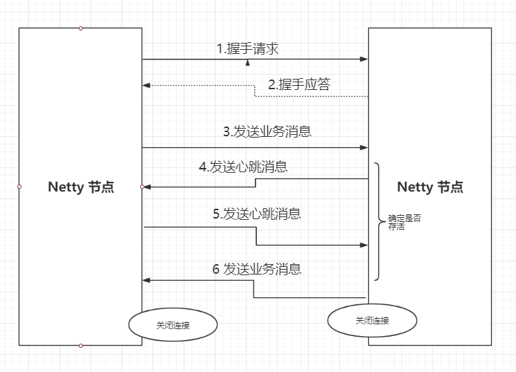
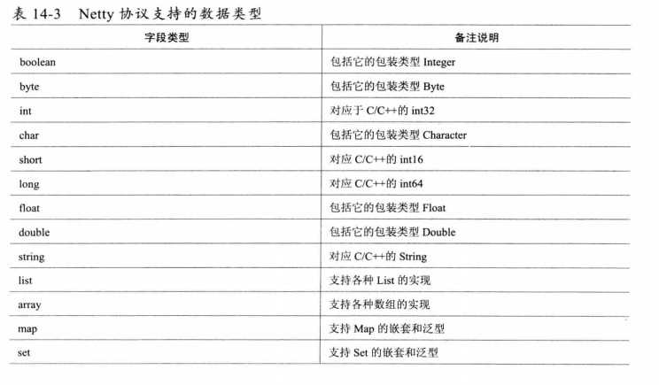

### Netty 私有协议栈开发

对于Netty节点来说，Netty并没有服务端和客户端之分，谁都可以成为客户端，对于集群环境上而言，可能谁先启动谁就是master，其余都是salve。他们彼此之前通过我们自己定义的Netty协议进行通信

#### 协议栈功能描述

Netty协议栈承载业务内部各模块之间的消息交互和服务调用，它的主要功能如下

* 基于Netty的NIO通信框架，提供高性能的异步通信能力
* 提供消息的编解码框架，可以实现POJO的序列化很反序列化
* 提供基于IP地址的白名单接入认证机制
* 链路的有效性校验机制
* 链路的断链重连机制

#### 通信模型

* Netty 协议栈客户端发送握手请求消息，携带节点ID等有效身份认证信息；
* Netty协议栈服务端对握手请求消息进行合法性校验，包括节点ID有效性校验、节点重复登录校验和IP地址合法性校验，校验通过后，返回登录成功的握手应答消息。
* 链路建立成功之后，客户端发送业务消息
* 链路建立成功之后，服务端发送心跳消息
* 链路建立成功之后，客户端发送心跳消息（表示我还活着）
* 链路建立成功之后，服务器发送业务消息
* 服务端退出的时候，服务端关闭连接，客户端感知对方关闭连接后，被动关闭客户端连接

**备注：**

需要说明的是，Netty协议通信双方链路建立成功之后，双方都可以进行全双工通信，无论客户端还是服务端，都可以制动发送请求消息给对方，通信方式可以TWO WAY活着是ONE WAY，双方之间的心跳采用Ping-Pong机制，当链路处于空闲状态时，客户端主动发送Ping消息给服务端，服务端接受到Ping消息后发送应答消息Pong给客户端，如果客户端连续发送N条Ping消息都没有接受到服务端返回的Pong消息，说明链路已经挂死或者对方处于异常状态，客户端主动关闭连接，间隔周期T后发起重连操作，知道重连成功。

#### 消息定义

Netty协议消息定义包含两个部分

* 消息头
* 消息体

Netty 消息定义表（NettyMessage）

|  名称  |  类型  | 长度 |                             描述                             |
| :----: | :----: | :--: | :----------------------------------------------------------: |
| header | Header | 变长 |                          消息头定义                          |
|  body  | Object | 变长 | 对于请求消息，他是方法的参数（作为示例，只支持携带一个参数；对于响应消息，它是返回值 |

Netty 协议消息头定义（Header）

|    名称    |        类型        | 长度 |                             描述                             |
| :--------: | :----------------: | :--: | :----------------------------------------------------------: |
|  crcCode   |      整型int       |  32  | Netty消息校验码，他由三部分组成： * 0xABEF：固定值，表示该消息是Netty协议消息，2个字节 * 主版本号：1-255 一个字节 * 次版本号：1-255 一个字节 * crcCdoe = 0xABEF+主版本号+次版本号 |
|   length   |      整型int       |  32  |            消息长度，整个消息，包括消息头和消息体            |
| seesionID  |     长整形long     |  64  |            集群节点内全局唯一，由会话ID生成器生成            |
|    type    |        Byte        |  8   | 0：业务请求消息 1：业务响应消息 2：业务ONE WAY消息（既是请求又是响应消息） 3：握手请求消息 4：握手应答消息 5：心跳请求消息 6：心跳应答消息  |
|  priority  |        Byte        |  8   |                      消息优先级：0-255                       |
| attachment | Map<String,Object> | 变长 |                   可选字段，用于扩展消息头                   |

Netty协议支持的字段类型

